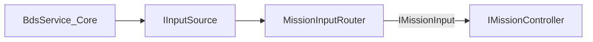

# Mission SDK v1 스펙

PinkSoft Core와 외부 미션 모듈 간 계약입니다. 구현: `Assets/MissionSDK/`

## 네임스페이스

`PinkSoft.MissionSDK`

## 환경 요구사항

- Unity **6000.5 LTS** 이상
- **URP** (Universal Render Pipeline) — Core와 동일 파이프라인. Built-In RP 미지원.

## 아키텍처: BDS는 Core 상주, 미션은 InputHit만 수신



- **BDS/LiDAR/UART/교정:** Core `BdsService` 전용. 미션 번들에 포함하지 않음.
- **미션:** `MissionContext.Input`(IMissionInput)으로 가공된 `InputHit`만 구독.
- **Raw LiDAR:** 미션에 전달하지 않음.

## IMissionController v1

```csharp
public interface IMissionController
{
    void InitializeMission(RuntimeUserData userData, MissionContext context);
    void OnPause();
    void OnResume();
    void Shutdown();
    void ReportEvent(ScoreEventType eventType, string targetId);

    event Action<int> OnScoreChanged;
    event Action<bool, MissionResultData> OnMissionEnded;
    event Action<MissionError> OnError;
}
```

### MissionContext

Core가 미션 로드 후 조립해 주입합니다.

```csharp
public class MissionContext
{
    public IMissionInput Input;   // MissionInputRouter
    public MissionConfig Config;
}
```

### 입력 구독 (미션 측)

```csharp
readonly MissionInputSubscription _inputSub = new();

public void InitializeMission(RuntimeUserData user, MissionContext context)
{
    _inputSub.Subscribe(context.Input, HandleHit);
}

public void Shutdown()
{
    _inputSub.Unsubscribe();
}

void HandleHit(InputHit hit)
{
    if (MissionHitUtility.TryRaycast(hit, targetLayer, out var rh))
        ReportEvent(ScoreEventType.TargetHit, rh.collider.name);
}
```

### 라이프사이클

1. Core가 미션 프리팹 인스턴스화
2. `MissionInputRouter.Bind()` — 활성 미션으로 입력 라우팅 시작
3. `InitializeMission(user, context)` — context.Input 구독
4. `OnPause` / `OnResume` — Core가 라우터 일시정지와 함께 호출
5. 미션 종료 → `Shutdown` — 입력 구독 해제 → `router.Unbind()`

### 점수 보고

미션은 **점수 숫자를 직접 올리지 않습니다.** `ReportEvent`로 이벤트만 보고하고 Core `ScoreEngine`이 가중치를 적용합니다.

## 입력 타입

### InputHit

```csharp
public readonly struct InputHit
{
    public Vector2 ScreenPosition;  // 스크린 픽셀 좌표
    public ulong TimestampUs;
}
```

### IInputSource (Core 구현용, 미션 번들 미참조)

BDS/Touch/Debug 구현체. 외부 미션은 `IMissionInput`만 사용.

### IMissionInput (미션 구독용)

Core `MissionInputRouter`가 구현. 활성 미션 1개에만 `OnHit` 전달.

## ScoreEventType

| 값 | 설명 |
|----|------|
| `TargetHit` | 타겟 적중 |
| `Combo` | 연속 적중 |
| `TimeBonus` | 시간 보너스 |
| `ObjectiveComplete` | 목표 달성 |
| `Penalty` | 감점 |

## 데이터 타입

### RuntimeUserData

```csharp
public class RuntimeUserData
{
    public string userId;
    public string nickname;
    public int currentLevel;
    public EquipmentStats equipment;
}
```

### EquipmentStats

```csharp
public class EquipmentStats
{
    public float accuracyBonus;   // 0.0 ~ 1.0
    public float scoreMultiplier; // 1.0 기본
    public int extraTimeSeconds;
}
```

### MissionConfig

`MissionContext.Config`로 전달.

```csharp
public class MissionConfig
{
    public int difficultyLevel;      // 1 Easy, 2 Normal, 3 Hard
    public string weatherCondition;
    public int timeLimitSeconds;
    public int targetScore;
}
```

### MissionResultData

`starsEarned`는 **Core가 계산**합니다.

## SDK 버전

`MissionSDKVersion.Current` = `"1.0.0"`

## 체크리스트 (외부 제작자)

- [ ] 루트 GameObject에 `IMissionController` 구현 컴포넌트 1개
- [ ] `InitializeMission`에서 `context.Input.OnHit` 구독 (`MissionInputSubscription` 권장)
- [ ] `Shutdown`에서 입력 구독 해제
- [ ] BDS/LiDAR/UART 코드 **미포함**
- [ ] `ReportEvent`만으로 점수 보고
- [ ] `OnError`로 복구 불가 오류 전달
- [ ] 메타데이터 JSON + Addressables 빌드 산출물 제출

## 교정

4점 Homography 교정·발사 테스트는 **로비** `BdsCalibrationMode` 시스템 모드에서 수행. 미션은 교정 완료된 `InputHit`만 수신합니다.
