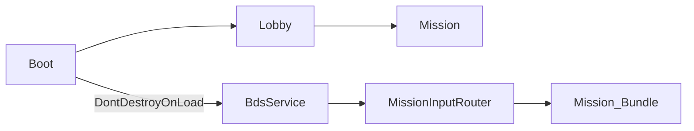

# PinkSoft Unity 프로젝트

## 폴더

| 경로 | 역할 |
|------|------|
| `Assets/BDS/` | LiDAR 시리얼, 필터 (Core `BdsService`가 사용) |
| `Assets/Core/` | BdsService, MissionInputRouter, 점수 엔진, 로비 교정 UI |
| `Assets/MissionSDK/` | `IMissionController`, `MissionContext`, `InputHit`, `IMissionInput` |
| `Assets/Missions/` | 내장 미션 3종 |
| `Assets/StreamingAssets/Missions/` | 카탈로그 JSON |

## 씬 권장 구성

1. **Boot** — `BdsService` (DontDestroyOnLoad), `MissionInputRouter` 초기화
2. **Lobby** — `LobbyCalibrationUI` (4점 교정), 미션 카탈로그
3. **Mission** — 번들 로드 미션만 배치. BDS/교정 UI 없음

## BDS + PMS 통합

| 계층 | 컴포넌트 | 역할 |
|------|----------|------|
| Core 상주 | `BdsService` | LiDAR 필터, 교정, IInputSource 선택 |
| Core 상주 | `MissionInputRouter` | 활성 미션에 InputHit 라우팅 |
| 미션 번들 | `IMissionController` | `MissionContext.Input` 구독 → Raycast → ReportEvent |

### Boot 씬 오브젝트

- `BdsService` (자동으로 BdsInputSource/Touch/Debug 구성)
- `MissionInputRouter`
- `MissionSessionController`

### Lobby 씬

- `LobbyCalibrationUI` — 교정 전용 (미션 씬에 두지 않음)

### Mission 씬

- `TargetShootingPrototype` 또는 번들 미션
- `MissionSessionController.StartMission(user, config)` 호출

## Addressables

미션 번들 빌드는 [Addressables ADR](../../docs/decisions/addressables.md)를 따릅니다.

외부 미션은 **MissionSDK만** 참조하고 BDS 어셈블리는 참조하지 않습니다.
